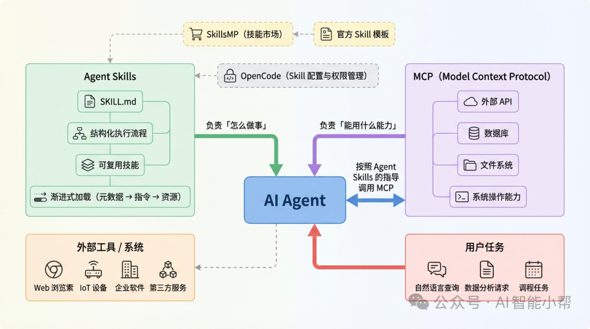

# Claude code使用指南

# Skills

## 什么是Skills？

Skills是模块化的能力包，包含指令、脚本和资源，让Claude在需要时自动加载和使用。

**"模块化"**：Skills是一个个独立的文件夹，每个Skill做一件事。比如"生成PPT"是一个Skill，"审校文章"是另一个Skill。

**"能力包"**：每个Skill文件夹里可以包含：

- SKILL.md（核心指令文件，必需）
- scripts/（可执行脚本，可选）
- references/（参考文档，可选）
- assets/（模板和资源，可选）

**"自动加载"**：你不需要手动告诉Claude"现在用XX Skill"。Claude会根据你的任务描述，自动判断需要哪个Skill，然后加载。

一个 Skill 至少是一个文件夹

```
skill-name/
├── SKILL.md              # 主要说明（触发时加载）
├── FORMS.md              # 表单填充指南（根据需要加载）
├── reference.md          # API 参考（根据需要加载）
├── examples.md           # 使用示例（根据需要加载）
└── scripts/
    ├── analyze_form.py   # 实用脚本（执行，不加载）
    ├── fill_form.py      # 表单填充脚本
    └── validate.py       # 验证脚本
```

官方最小可用模板

```markdown
---
name: example-skill
description: 简要说明该技能的用途和适用场景
---

## 使用场景
说明在什么情况下应该使用这个 Skill。

## 执行步骤
1. 第一步要做什么
2. 第二步要做什么
3. 异常情况如何处理

## 输出要求
说明输出格式或必须包含的内容。
```

更推荐的实战模板

```markdown
---
name: security-log-analysis
description: 对安全日志进行结构化分析，判断是否存在异常行为
metadata:
  version: 1.0
  author: ailot
---

## 技能目标
明确这个 Skill 希望 Agent 达成的目标。

## 输入说明
- 支持的输入类型
- 必须包含的字段

## 执行流程
1. 识别数据类型
2. 提取关键字段
3. 进行规则或逻辑判断
4. 输出分析结论

## 输出格式
- 是否异常：
- 判断依据：
- 风险说明：
- 建议动作：

## 注意事项
- 无法确认时必须说明不确定性
- 禁止空泛总结
```


## 什么是渐进式披露？

简单说，就是**分阶段、按需加载**。

一个Skill包含很多内容：核心指令、参考文档、执行脚本、模板资源。但Claude不会一次性把所有内容都加载进上下文。它采用三层加载机制：

**第一层：元数据（Metadata）—— 总是加载**

内容：SKILL.md文件开头的YAML部分，就两个字段：name和description。

```
---name: ai-proofreading
description: 系统化降低AI检测率，增加人味。使用场景：审校文章、降低AI味、初稿完成后。
---
```

加载时机：Claude启动时就加载所有Skills的元数据。

Token成本：每个Skill大约100 tokens。就算你装了50个Skills，也就5000 tokens。

作用：让Claude知道有哪些Skills可用，什么时候该用哪个。

**第二层：指令（Instructions）—— 触发时加载**

内容：SKILL.md的主体部分，详细的操作指南。

加载时机：当用户请求匹配某个Skill的description时，Claude才加载这个Skill的完整内容。

Token成本：通常在3000-5000 tokens。

作用：告诉Claude具体怎么做。

**第三层：资源（Resources）—— 引用时加载**

内容：scripts/目录里的脚本、references/目录里的参考文档、assets/目录里的模板。

加载时机：只有当SKILL.md中的指令引用这些文件时才加载。

Token成本：几乎无限——脚本执行后只有输出进入上下文，代码本身不占Token。

作用：提供确定性的执行能力和详细的参考资料。

# Skills vs MCP vs Subagent

## 三者关系

MCP让Claude能碰到外部系统。Skills告诉Claude碰到之后怎么用。Subagent是派一个人出去干活。

**MCP（Model Context Protocol）**

MCP是什么？一个连接协议。它让Claude能够访问外部系统：数据库、API、文件系统、各种SaaS服务。

你可以把MCP想象成"给Claude发工具"。

比如GitHub MCP，让Claude能够读取仓库、创建PR、管理Issues。Notion MCP，让Claude能够读写Notion页面。

MCP的核心价值是**连接**。它解决的问题是"Claude能访问什么数据"。

**Skills**

Skills是什么？使用手册。它告诉Claude拿到数据之后怎么用。

比如你用GitHub MCP连接了仓库，Claude能读代码了。但"怎么做代码审查"——检查哪些方面、用什么标准、输出什么格式——这些是Skills的工作。

你可以把Skills想象成"教Claude怎么用工具"。

Skills的核心价值是**程序化知识**。它解决的问题是"Claude应该怎么做"。

**Subagent**

Subagent是什么？派出去干活的人。

当你让Claude Code派一个Subagent去做任务时，Claude会新开一个独立的对话会话。这个Subagent有自己的上下文窗口、自己的系统提示、自己的工具权限。它干完活，把结果带回来。

你可以把Subagent想象成"派一个助手出去"。

Subagent的核心价值是**并行执行和上下文隔离**。它解决的问题是"怎么处理复杂的多步骤任务"。



## 什么时候用哪个？

**用MCP**：当你需要连接外部系统。

- 查询数据库
- 调用第三方API
- 读写Notion、Jira、GitHub等

**用Skills**：当你有重复性的工作流程。

- 代码审查流程
- 文章审校流程
- 报告生成流程
- 任何"每次都要说一遍"的规则

**用Subagent**：当任务复杂、需要并行执行。

- 审查整个代码仓库（耗时长）
- 同时处理多个独立任务
- 需要防止上下文污染